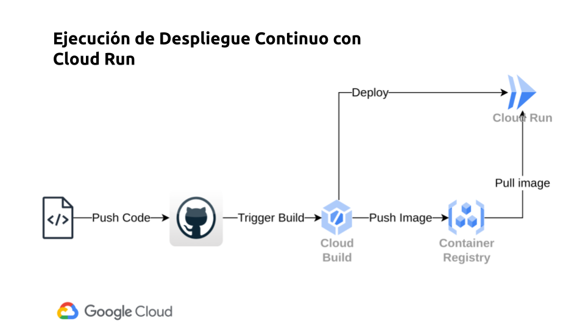

# Documentación General de la API

## Tabla de Contenidos
1. [Introducción](#introducción)
2. [Requisitos Previos](#requisitos-previos)
3. [Instalación](#instalación)
   - [Clonación del Repositorio](#clonación-del-repositorio)
   - [Configuración del Entorno](#configuración-del-entorno)
4. [Uso de Docker](#uso-de-docker)
   - [Construcción de la Imagen](#construcción-de-la-imagen)
   - [Ejecución del Contenedor](#ejecución-del-contenedor)
   - [Detener y Eliminar Contenedores](#detener-y-eliminar-contenedores)
5. [Endpoints de la API](#endpoints-de-la-api)
   - [POST /predict](#post-predict)
6. [Manejo de Errores](#manejo-de-errores)

---

## Introducción



Esta API permite la clasificación de imágenes histopatológicas para detectar cáncer de mama. Utiliza modelos de aprendizaje profundo con CNN y Grad-CAM para ofrecer predicciones precisas y mapas de activación que resaltan las regiones más relevantes en la imagen analizada.

---

## Requisitos Previos
- Docker instalado.
- Git instalado.
- Python 3.11 o superior (para desarrollo).
- Configuración básica del sistema operativo.

## Instalación

### Clonación del Repositorio
Clona el repositorio del proyecto:
```bash
git clone https://github.com/jrbeduardo/proyecto-cancer.git
cd proyecto-cancer
```

## Carga del modelo

El archivo de modelo necesario para ejecutar la API es bastante pesado y no está incluido directamente en el repositorio. Puedes descargarlo desde el siguiente enlace:

[Descargar modelo cancer_detection_model.h5](https://drive.google.com/file/d/1lZ4KvZYrHGOYapTSEFQ4GjMPmq7UNA3I/view?usp=sharing)

Por favor, guarda el archivo en la ubicación indicada en la configuración del modelo (`/app/cancer_detection_model.h5` si usas Docker).

## Uso de Docker

### Construcción de la Imagen
Construye la imagen de Docker:
```bash
docker build -t cancer-api .
```

### Ejecución del Contenedor
Inicia el contenedor con Docker:
```bash
docker run -d -p 80:80 cancer-api
```
Accede a la API en `http://localhost:80/docs` para la documentación interactiva.

### Detener y Eliminar Contenedores
Para detener un contenedor:
```bash
docker stop id_contenedor
```
Para eliminarlo:
```bash
docker rm id_contenedor
```

---

## Endpoints de la API

### POST /predict
**Descripción:** Clasifica una imagen histopatológica para detectar cáncer de mama.

**Request Body:**
```json
{
    "image_base64": "/9j/4AAQSkZJRgAB..."
}
```

**Ejemplo de Solicitud con cURL:**
```bash
curl -X POST -H "Content-Type: application/json" -d '{"image_base64": "base64_string"}' http://localhost:80/predict
```

**Ejemplo de Respuesta:**
```json
{
    "prediction": "maligno",
    "confidence": 0.95,
    "gradcam_base64": "/9j/4AAQSkZJRgAB..."
}
```

**Interpretación de la Respuesta:**
- `prediction`: Indica si el tejido analizado es `benigno` o `maligno`.
- `confidence`: Representa el nivel de certeza de la clasificación, con valores entre 0 y 1.
- `gradcam_base64`: Contiene la imagen Grad-CAM generada por el modelo, en formato Base64, resaltando las zonas más relevantes en la decisión.

---

## Manejo de Errores
La API devuelve respuestas HTTP con códigos de error estándar:
- **400**: Error en la solicitud (p. ej., imagen inválida o no soportada).
- **404**: Endpoint no encontrado.
- **500**: Error interno del servidor.

## Observaciones

- Los modelos deben estar entrenados y disponibles en el directorio `/app`.
